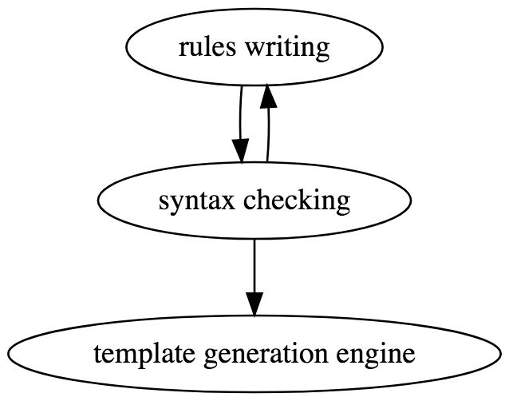

# GENERA
**GENE**rate co**R**por**A** (GENERA)

Generate corpora using patterns and rules for system cold start.

### 1.Introduction
`GENERA` consists of three parts: rules writing, syntax checking and template generation engine.



### 2.Rules writing

Responsible for writing generation rules and corresponding tags by task description and expert induction. Basically, this method defines four grammatical units: `unit, or, replacement, existence`.

In `./data/ `folder, `tags.txt` is the tag elements:

```
t_语气词:
啊
哦
额
呢
吗
嘛

t_数字:
一
二
三
四
```

Every element  identification strats with `t_`, end with `:`, and evrey element is in one line.

`patterns.txt`is the patterns:

```
p_否定:
(不)(是|用)(了|的|[t_语气词]||)
算了
非也
错了
no

p_没听清:
(信号)(不好|差)
(没听|听不)(清|清楚|太清)
(你||)(说|说的|刚说|讲||)(啥|什么)
大声点
大点声
声音大点
声音小
声音太小
没听明白
哪个东西
啥东西
啥意思
啥玩意
```

Every element  identification strats with `p_`, end with `:`, and evrey element is in one line.

* `unit`=()
* `or`=|
* `replacement`=[]
* `existence`=||

If in `tags.txt`:
```
t_语气词:
啊
哦
嘛
```

Unfold`(不)(是|用)(了|的|[t_语气词]||)`:

```
不是了
不是的
不是啊
不是哦
不是嘛
不用了
不用的
不用啊
不用哦
不用嘛
不用
不是
```

### 3.Syntax checking

The grammer is strict, so we will firstly check the syntax. If problems existing,   error will be occurred, and messages will be demonstrated.

```
Some Undefiend Characters in the intention file 
The bracket is not matching
Some entity is not in the bracket
Every item has existing symbol
The existing symbol puts in wrong place
```

### 4.Template generation engine

Generate corpora with files, and create the `final.csv`.

For example:

```
p_否定	不是|不用|不对|不确认|不确定|不是不是|不需要|不是了|不是的|不是毿|不用了|不用的|不用毿|不对了|不对的|不对毿|不确认了|不确认的|不确认毿|不确定了|不确定的|不确定毿|不是不是了|不是不是的|不是不是毿|不需要了|不需要的|不需要毿|算了|非也|错了|no
```

### 5.使用
```shell
python runner.py --base_dir [目录] --tag [tag文件名] --pattern [pattern文件名] --target [结果文件名]
```
如果不使用参数，则目录为`runner.py`所在目录，tag文件为`runner.py`所在目录下的`./data/tags.txt`，pattern 文件为`runner.py`所在目录下的`./data/patterns.txt`，结果保存在`runner.py`所在目录下的`./data/final.txt`
